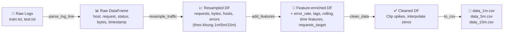

# Phân tích Chi tiết Quy trình Làm sạch & Xử lý Dữ liệu cho LSTM

> Bạn đã đúng: quá trình R&D trên notebook nằm tại `eda.ipynb` và `process_data.ipynb`, sau đó được module hóa thành [src/data_loader.py](file:///Users/user/Documents/codein/MachineLearning/Dataflow/Autoscaling-Analysis/src/data_loader.py) và [src/features.py](file:///Users/user/Documents/codein/MachineLearning/Dataflow/Autoscaling-Analysis/src/features.py). Dưới đây là phân tích từng bước.

---

## 1. Tổng quan Luồng Dữ liệu (Data Pipeline)



---

## 2. Bước 1: Đọc & Parse Raw Logs

**Notebook:** `process_data.ipynb` (cell đầu tiên) → **Production:** [data_loader.py](file:///Users/user/Documents/codein/MachineLearning/Dataflow/Autoscaling-Analysis/src/data_loader.py)

### Dữ liệu nguồn
Dự án sử dụng dữ liệu **NASA HTTP Web Server Logs** (năm 1995). Đây là file log text thuần, mỗi dòng có dạng:

```
199.72.81.55 - - [01/Jul/1995:00:00:01 -0400] "GET /history/apollo/ HTTP/1.0" 200 6245
```

### Hàm [parse_log_line(line)](file:///Users/user/Documents/codein/MachineLearning/Dataflow/Autoscaling-Analysis/src/data_loader.py#6-17)

Dùng **Regex** (`LOG_PATTERN` trong [settings.py](file:///Users/user/Documents/codein/MachineLearning/Dataflow/Autoscaling-Analysis/config/settings.py)) để trích xuất từng trường:

| Trường | Ý nghĩa | Ví dụ |
|--------|----------|-------|
| `host` | IP/hostname client | `199.72.81.55` |
| `timestamp` | Thời gian request | `01/Jul/1995:00:00:01 -0400` |
| `request` | HTTP request string | `GET /history/apollo/ HTTP/1.0` |
| `status` | HTTP status code | `200` (int) |
| `bytes` | Response size | `6245` (int, hoặc `0` nếu là `'-'`) |

### Hàm [load_and_process_logs(file_paths)](file:///tmp/process_data_notebook.py#30-55)

1. Lặp qua từng file log (`train.txt`, `test.txt`), đọc từng dòng.
2. Gọi [parse_log_line()](file:///Users/user/Documents/codein/MachineLearning/Dataflow/Autoscaling-Analysis/src/data_loader.py#6-17) cho mỗi dòng, bỏ qua dòng không match regex.
3. Gom vào `pd.DataFrame`, chuyển cột `timestamp` sang `datetime` và **sort theo thời gian**.

> **Kết quả:** DataFrame thô chứa hàng triệu dòng, mỗi dòng là một HTTP request riêng lẻ.

---

## 3. Bước 2: Resampling (Gom nhóm theo khung thời gian)

**Notebook:** `process_data.ipynb` → **Production:** [data_loader.py#resample_traffic](file:///Users/user/Documents/codein/MachineLearning/Dataflow/Autoscaling-Analysis/src/data_loader.py#L54-L72)

### Hàm [resample_traffic(df, window='5min')](file:///Users/user/Documents/codein/MachineLearning/Dataflow/Autoscaling-Analysis/src/data_loader.py#54-73)

**Tại sao cần Resample?** Dữ liệu log raw ghi từng request riêng lẻ (hàng triệu dòng). LSTM cần dữ liệu dạng time-series đều đặn. Ta gom lại theo cửa sổ thời gian (1 phút, 5 phút, hoặc 15 phút).

**Cách hoạt động:**

| Cột gốc | Phép tính | Cột kết quả | Ý nghĩa |
|----------|-----------|-------------|----------|
| `request` | `count` | `requests` | Số lượng request trong khung |
| `bytes` | `sum` | `bytes` | Tổng bytes truyền |
| `host` | `nunique` | `hosts` | Số host duy nhất |
| `status` | `lambda x: (x >= 400).sum()` | `errors` | Số request lỗi (status ≥ 400) |

Các khoảng trống (không có request nào) được fill bằng `0`.

> **Dự án tạo 3 bộ dữ liệu:** `df_1m`, `df_5m`, `df_15m`. **Bộ 5 phút ([5m](file:///tmp/process_data_notebook.py#186-244)) được sử dụng chính cho LSTM** vì cân bằng giữa độ chi tiết và lượng noise.

---

## 4. Bước 3: Feature Engineering (Trích xuất Đặc trưng)

**Notebook:** `process_data.ipynb` (hàm [add_features_5m](file:///tmp/process_data_notebook.py#186-244) rồi tổng quát hóa thành [add_features](file:///Users/user/Documents/codein/MachineLearning/Dataflow/Autoscaling-Analysis/src/features.py#6-105)) → **Production:** [features.py#add_features](file:///Users/user/Documents/codein/MachineLearning/Dataflow/Autoscaling-Analysis/src/features.py#L6-L104)

Đây là bước **quan trọng nhất** và cũng phức tạp nhất. Gồm 7 giai đoạn:

### 4.1. Tính Error Rate
```python
df['error_rate'] = df['errors'] / (df['requests'] + 1e-9)
```
- Tỷ lệ lỗi = số request lỗi / tổng request.
- Cộng `1e-9` để tránh chia cho 0 khi khoảng thời gian không có request.

### 4.2. Xử lý Outages (Imputation) — ⭐ Điểm then chốt

**Bối cảnh:** Dữ liệu NASA có 2 giai đoạn hệ thống bị sập (do bão):
- **Outage 1:** `1995-07-28 13:32` → `1995-08-01 00:00`
- **Outage 2:** `1995-08-01 14:52` → `1995-08-03 04:36`

Trong các khoảng này, số request gần bằng `0` → **không phản ánh nhu cầu thực tế** mà chỉ là do server chết. Nếu để yên, model sẽ "học" rằng "cuối tháng 7 → traffic giảm" — hoàn toàn sai.

**Giải pháp: Imputation bằng dữ liệu tuần trước đó (shift 7 ngày)**

```python
for start, end in OUTAGES:
    mask = (df.index >= start) & (df.index <= end)
    df.loc[mask, 'requests_target'] = df['requests'].shift(lag_7d_steps).loc[mask]
    df.loc[mask, 'error_rate'] = df['error_rate'].shift(lag_7d_steps).loc[mask]
```

**Tại sao shift 7 ngày?** Web traffic có tính **chu kỳ tuần** (weekday vs weekend). Tuần trước đó tại cùng giờ, cùng thứ sẽ có pattern tương tự nhất.

> Cột `requests_target` chính là cột target "đã sửa lỗi" mà LSTM sẽ học để dự đoán, thay vì cột `requests` gốc.

Notebook `process_data.ipynb` cũng có hàm [plot_imputation_check()](file:///tmp/process_data_notebook.py#118-175) để **trực quan** so sánh data tuần bị crash với tuần trước – đảm bảo logic imputation hợp lý.

### 4.3. Lag Features (Đặc trưng trễ)

```python
df['req_lag_1']   = df['requests_target'].shift(1)     # 5 phút trước
df['req_lag_12']  = df['requests_target'].shift(12)    # 1 giờ trước
df['req_lag_288'] = df['requests_target'].shift(288)   # 24 giờ trước
```

| Feature | Ý nghĩa | Mục đích |
|---------|---------|----------|
| `req_lag_1` | Giá trị 1 bước trước (5 phút) | Nắm bắt xu hướng ngắn hạn |
| `req_lag_12` | Giá trị 12 bước trước (1 giờ) | Nắm bắt pattern theo giờ |
| `req_lag_288` | Giá trị 288 bước trước (24 giờ) | Nắm bắt chu kỳ ngày |

> **Tại sao cần Lag?** LSTM đã có khả năng nhớ, nhưng Lag features giúp model "nhìn thấy" trực tiếp các mốc thời gian quan trọng mà không cần tự học từ đầu.

### 4.4. Rolling Features (Đặc trưng trung bình trượt)

```python
df['rolling_mean_1h']  = df['requests_target'].rolling(window=12).mean()   # Trung bình 1h
df['rolling_std_1h']   = df['requests_target'].rolling(window=12).std()    # Độ lệch chuẩn 1h
df['rolling_mean_24h'] = df['requests_target'].rolling(window=288).mean()  # Trung bình 24h
```

| Feature | Ý nghĩa |
|---------|---------|
| `rolling_mean_1h` | Xu hướng trung bình ngắn hạn (1 giờ) |
| `rolling_std_1h` | Mức độ dao động (volatility) trong 1 giờ |
| `rolling_mean_24h` | Xu hướng dài hạn, nền tảng baseline |

### 4.5. Error Rate Features

```python
df['err_lag_1']             = df['error_rate'].shift(1)
df['err_rolling_mean_1h']   = df['error_rate'].rolling(window=12).mean()
```
Cung cấp thông tin về **tỷ lệ lỗi gần đây** — nếu lỗi đang tăng, có thể hệ thống sắp quá tải → tín hiệu cho autoscaling.

### 4.6. Time Features (Cyclical Encoding) — ⭐ Kỹ thuật hay

```python
df['hour_sin'] = np.sin(2 * π * hour / 24)
df['hour_cos'] = np.cos(2 * π * hour / 24)
df['is_weekend'] = (dayofweek >= 5).astype(int)
```

**Tại sao dùng sin/cos thay vì số giờ trực tiếp?**  
Nếu dùng `hour_of_day = 0, 1, ..., 23`, model sẽ hiểu rằng giờ 23 và giờ 0 cách nhau 23 đơn vị. Thực tế, chúng chỉ cách nhau 1 giờ. Bằng sin/cos, điểm 23h và 0h nằm **gần nhau** trên đường tròn lượng giác → model nhận ra tính **tuần hoàn**.

### 4.7. Clean up
- `dropna()` bỏ các dòng đầu bị NaN (do shift/rolling chưa đủ cửa sổ).
- Type cast các cột về đúng kiểu dữ liệu.

---

## 5. Bước 4: Làm sạch dữ liệu (Clean Data)

**Notebook:** `process_data.ipynb` (gọi [clean_data](file:///Users/user/Documents/codein/MachineLearning/Dataflow/Autoscaling-Analysis/src/features.py#107-135) từ `src/features`) → **Production:** [features.py#clean_data](file:///Users/user/Documents/codein/MachineLearning/Dataflow/Autoscaling-Analysis/src/features.py#L107-L135)

### Hàm [clean_data(df, quantile_threshold=0.99)](file:///Users/user/Documents/codein/MachineLearning/Dataflow/Autoscaling-Analysis/src/features.py#107-135)

Có 2 nhiệm vụ:

#### a) Xử lý Spikes (Đỉnh bất thường)
```python
threshold = df['requests_target'].quantile(0.99)
df['is_spike'] = (df['requests_target'] > threshold).astype(int)
df.loc[df['is_spike'] == 1, 'requests_target'] = threshold
```
- Tìm ngưỡng **percentile 99** của `requests_target`.
- Đánh dấu các điểm vượt ngưỡng là spike (`is_spike = 1`).
- **Clip** (cắt) các giá trị spike về ngưỡng.

> **Tại sao?** Các spike cực đoan (như DDoS, hoặc bot crawling) không phản ánh traffic thực. Nếu không xử lý, model sẽ bị ảnh hưởng nặng bởi các outliers này.

#### b) Xử lý giá trị bằng 0
```python
df.loc[df['requests_target'] == 0, 'requests_target'] = np.nan
df['requests_target'] = df['requests_target'].interpolate(method='time')
```
- Thay các giá trị `0` (có thể do hệ thống ngắt ngắn hạn) bằng `NaN`.
- Dùng **Time-based Interpolation** nội suy lại giá trị — đây là phương pháp phù hợp nhất cho time-series vì nó tính theo khoảng cách thời gian thực.

---

## 6. Bước 5: EDA (Phân tích Khám phá)

**Notebook:** [eda.ipynb](file:///Users/user/Documents/codein/MachineLearning/Dataflow/Autoscaling-Analysis/notebooks/eda.ipynb)

Notebook EDA phân tích 3 khía cạnh:

| Phân tích | Hàm | Mục đích |
|-----------|-----|----------|
| So sánh 3 khung thời gian | [quick_compare()](file:///tmp/eda_notebook.py#26-49) | Xem trade-off giữa 1m (quá nhiều noise), 5m (cân bằng), 15m (quá mượt) |
| Phân bố theo giờ & ngày | [eda_by_seasonality()](file:///tmp/eda_notebook.py#54-71) | Xác nhận tính chu kỳ (traffic cao vào giờ làm việc, thấp cuối tuần) → cơ sở cho `hour_sin`, `hour_cos`, `is_weekend` |
| Phát hiện sự kiện bão | Biểu đồ fill_between | Xác nhận 2 khoảng outage cần impute |

---

## 7. Quá trình chuyển từ Notebook sang Production Code

### So sánh chi tiết

| Khía cạnh | Notebook | Production Code |
|-----------|----------|-----------------|
| Parse logs | Hàm inline trong `process_data.ipynb` | [data_loader.py](file:///Users/user/Documents/codein/MachineLearning/Dataflow/Autoscaling-Analysis/src/data_loader.py) |
| Resample | Hàm inline trong `process_data.ipynb` | [data_loader.py#resample_traffic](file:///Users/user/Documents/codein/MachineLearning/Dataflow/Autoscaling-Analysis/src/data_loader.py#L54-L72) |
| Feature engineering | [add_features_5m()](file:///tmp/process_data_notebook.py#186-244) hardcoded 5m → tổng quát hóa [add_features(frequency)](file:///Users/user/Documents/codein/MachineLearning/Dataflow/Autoscaling-Analysis/src/features.py#6-105) | [features.py#add_features](file:///Users/user/Documents/codein/MachineLearning/Dataflow/Autoscaling-Analysis/src/features.py#L6-L104) |
| Clean data | Viết trực tiếp trong notebook | [features.py#clean_data](file:///Users/user/Documents/codein/MachineLearning/Dataflow/Autoscaling-Analysis/src/features.py#L107-L135) |
| Constants (OUTAGES, FREQUENCY_PARAMS) | Hardcoded trong notebook | Tách ra [settings.py](file:///Users/user/Documents/codein/MachineLearning/Dataflow/Autoscaling-Analysis/config/settings.py) |

### Những cải tiến khi chuyển sang Production

1. **Tham số hóa tần suất:** Notebook ban đầu viết [add_features_5m()](file:///tmp/process_data_notebook.py#186-244) cứng cho 5 phút. Production code dùng dict `FREQUENCY_PARAMS` để hỗ trợ `1m`, [5m](file:///tmp/process_data_notebook.py#186-244), `15m` linh hoạt.
2. **Tách constants:** `OUTAGES`, `LOG_PATTERN`, `FREQUENCY_PARAMS` được đưa ra [config/settings.py](file:///Users/user/Documents/codein/MachineLearning/Dataflow/Autoscaling-Analysis/config/settings.py) → dễ thay đổi mà không sửa logic.
3. **Docstrings chuẩn:** Mọi hàm đều có docstring mô tả parameters và returns.
4. **Hàm [validate_data_shapes](file:///Users/user/Documents/codein/MachineLearning/Dataflow/Autoscaling-Analysis/src/lstm/data/data_preparation.py#243-276)**: Thêm validation kiểm tra dữ liệu trước khi đưa vào model (không có trong notebook).

---

## 8. Tóm tắt cho Phỏng vấn

Khi được hỏi "Anh/chị xử lý dữ liệu như thế nào?", có thể trả lời theo flow:

1. **Parse:** Đọc raw log text bằng Regex → DataFrame.
2. **Resample:** Gom request riêng lẻ thành chuỗi thời gian đều (mỗi 5 phút).
3. **Impute Outages:** Thay thế giai đoạn hệ thống sập bằng dữ liệu tuần trước (shift 7 ngày) vì traffic có tính chu kỳ tuần.
4. **Feature Engineering:** Tạo lag features (nhìn quá khứ), rolling statistics (xu hướng), cyclical time encoding (sin/cos cho giờ), và error rate.
5. **Clean Spikes:** Clip outliers vượt percentile 99 và interpolate các giá trị 0 bất thường.
6. **Export:** Lưu thành CSV sạch, sẵn sàng cho LSTM training.
